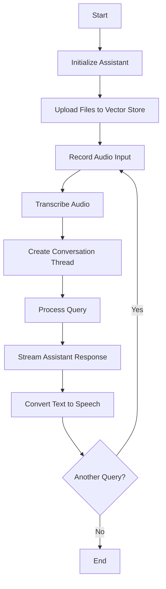

# OpenAI Assistant

This Python script demonstrates how to use the OpenAI API to create an AI assistant capable of understanding voice commands, searching through files, and providing spoken responses. The assistant can be customized with a name, instructions, and a list of available tools.

## Workflow



## Features

* Create a new assistant or retrieve an existing one using the OpenAI API.
* Upload files to a vector store and associate them with the assistant for file search capabilities.
* Record and transcribe audio input using PyAudio and the OpenAI Whisper API.
* Create a conversation thread with the assistant, attaching relevant files for context.
* Stream the assistant's responses and handle events such as text creation, tool calls, and message completion.
* Convert the assistant's text responses to speech using text-to-speech functionality.

## Requirements

* Python 3.6 or later
* OpenAI Python library (`openai`)
* PyAudio library (`pyaudio`)
* wave library (part of the Python standard library)

## Installation

1. Clone the repository:
   ```
   git clone https://github.com/yourusername/openai-assistant.git
   cd openai-assistant
   ```

2. Install the required packages:
   ```
   pip install openai pyaudio
   ```

## Usage

1. Set up your OpenAI API key in the `api_key` variable in the `Assistant.py` file.

2. Customize the assistant's name, instructions, and tools as needed.

3. Provide the necessary files (e.g., `BankData.txt`, `Guide_Bank_Data.txt`) in the same directory as the `Assistant.py` script.

4. Run the script:
   ```
   python Assistant.py
   ```

5. The assistant will start listening for voice input. Speak your query or command, and the assistant will provide a spoken response based on the available information and instructions.

## Customization

You can customize the assistant by modifying the following parameters in the `Assistant.py` file:

- `assistant_name`: Set the name of your assistant
- `assistant_instructions`: Provide specific instructions for your assistant's behavior
- `tools`: Define the tools available to your assistant (e.g., file search, code interpreter)

## Contributing

Contributions are welcome! Please open an issue or submit a pull request if you have any improvements or bug fixes.

## License

This project is licensed under the MIT License. See the [LICENSE](LICENSE) file for details.

## Acknowledgments

* OpenAI for their powerful language models and APIs.
* PyAudio for audio recording functionality.
* wave for handling audio file operations.

## Troubleshooting

If you encounter any issues with audio recording or playback, ensure that your system's audio devices are properly configured and that you have the necessary permissions to access them.

## Future Improvements

- Add support for multiple languages
- Implement a graphical user interface (GUI) for easier interaction
- Expand the assistant's capabilities with additional tools and integrations
